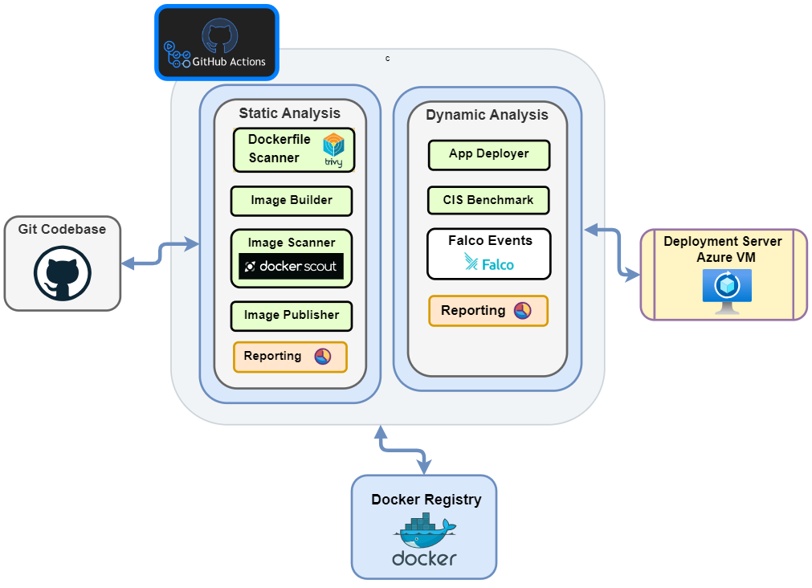

# Secure DevOps Demo w/ CIS Docker Benchmark 

A vulnerable NodeJS app to demonstrate secure container mangement practices according [CIS Docker Benchmark](https://www.cisecurity.org/benchmark/docker) v1.5.0.

The system proposes a DevSecOps framework leveraging static analysis and dynamic analysis tools implemented through **GitHub Actions** workflow.

## Integrated Tools 
- [Trivy Security Scanner (Aqua Security)](https://trivy.dev/)
- [Docker Scout CLI](https://github.com/docker/scout-cli)
- [Docker Bench for Security](https://github.com/docker/docker-bench-security)
- [Falco Runtime Threat Detection (Sysdig)](https://falco.org/)

## Workflow Architecture

## Workflow Sequence

1. **Continuous Integration - Static analysis**
    1. Dockerfile scan (Trivy)
	2. Docker Image scan (docker scout)
        - Quickview report
        - Base image report
	    - CVE report
   > _💡 NOTE: After CI run, Docker Image is available Docker Hub_
2. **Continuous Deployment - Dynamic analysis**
 
	1. CIS Benchmark scan (docker-bench) 
        - Report
	2. Falco Runtime Event Detection 
        - Events Log 
   > _💡 NOTE: CD run initiates with the Docker image being deployed on the server_
<!--
## ADD LATER: 
    - Contents from Report  
    - How to Build Section
        - Prepare Repo
        - Prepare Workflow 
        - Prepare Deployment Server
    - How to integrate this in your own pipeline 
    - IDEA: Add a custom badge for Azure VM health-check
-->

## Courtesy
* NodeJS App Sample - [@sd031](https://github.com/sd031/sample-nodejs-docker-app/tree/master) 
* Vulnerable Dockerfile - [@SamP10](https://github.com/SamP10/VulnerableDockerfile/tree/main) 
